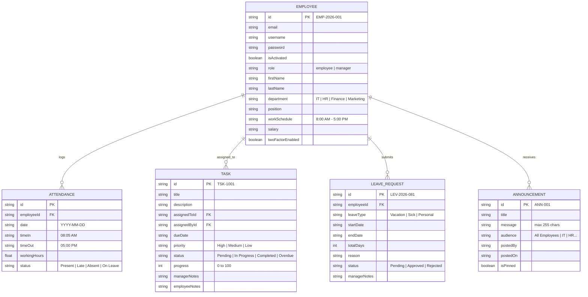

# Employee Management System (EMS v3.0) — Implementation & Architecture Plan

**Project:** EMS — School Project  
**Author:** James Maqui R. Pantas  
**Document Version:** 3.0  
**Target Date:** September / October 2026  
**Figma Design Reference:** `Pantas--James-Maqui-BSIT-3-1`  

---

## 1. Executive Summary & System Overview

The **Employee Management System (EMS)** is a web-based platform designed to unify and streamline daily workplace activities for two primary stakeholders:
1. **Employees**: Manage daily attendance (Time In/Time Out), track assigned deliverables (My Work), apply for and monitor leave requests, view company bulletins, and configure profile & authentication settings.
2. **Department Managers**: Supervise department staff rosters, monitor punctuality and timesheet logs, create and assign tasks with progress tracking, make decisions on leave requests (Approve/Reject), and compose company/department announcements.

---

## 2. Core Stakeholders & Role Matrix

| Capability / Module | Employee Role | Department Manager Role |
| :--- | :--- | :--- |
| **Account Access** | Email/ID + Password Login & First-Time Activation | Email/ID + Password Login & First-Time Activation |
| **Dashboard** | Personal Daily Summary, Attendance Punch, Task & Leave Overview | Department Overview, Headcount, Today's Attendance, Leave Review Inbox |
| **Attendance** | Personal Punch In/Out, Working Hours, Monthly Timesheet Log | Department-wide Attendance Monitor, Date Range Picker, CSV Export |
| **Tasks** | View Assigned Tasks, Update Status (Pending/In Progress/Completed) | Create & Assign Tasks, Update Progress Slider (0-100%), Manager Notes |
| **Announcements** | View-only feed, Filter by audience/pinned, download attachments | Full Publisher: Compose, Edit, Delete, Pin, 255-char counter, file upload |
| **Leave Requests** | Submit applications, auto-days calculator, balance tracker | Central Inbox: Approve (quota deduction), Reject, Manager Feedback |
| **Employee Roster** | Restricted | Searchable staff list, detailed dossier, performance, docs repository |
| **Reports** | Restricted | Department Analytics, On-time Punctuality %, Task Velocity, CSV/Print |
| **Account Settings** | Editable Profile, Password Policy, 2FA, SMS Recovery | Editable Profile, Password Policy, 2FA, SMS Recovery |

---

## 3. UI/UX & Design System (Figma Spec Alignment)

```
+-----------------------------------------------------------------------------------+
|  Canvas: Sage Green (#4A7268 / #517B71) with Rounded Container Card               |
|                                                                                   |
|  +----------------+-------------------------------------------------------------+ |
|  | [M] Maqui      | [Dashboard / Attendance / Tasks...]      [Search...] [Bell] | |
|  |                +-------------------------------------------------------------+ |
|  | MAIN MENU      |                                                             | |
|  | - Dashboard    |   +-------------------+ +-----------------+ +-------------+ | |
|  | - Employees    |   | Total Staff: 35   | | Present: 29     | | Absent: 6   | | |
|  | - Task         |   +-------------------+ +-----------------+ +-------------+ | |
|  | - Reports      |                                                             | |
|  |                |   +-----------------------------+ +-----------------------+ | |
|  | ADMINISTRATION |   | Attendance Summary (Bars)   | | Latest Announcement   | | |
|  | - Settings     |   +-----------------------------+ +-----------------------+ | |
|  |                |                                                             | |
|  | SUPPORT        |   +-------------------------------------------------------+ | |
|  | - Help & Info  |   | Leave Overview (Approved: 22 | Pending: 7 | Rem: 7)   | | |
|  |                |   +-------------------------------------------------------+ | |
|  | [User Profile] |                                                             | |
|  +----------------+-------------------------------------------------------------+ |
+-----------------------------------------------------------------------------------+
```

### Color Palette & Visual Tokens
- **Background Canvas**: Sage Green (`#4A7268` / `#3D635B`)
- **Card Surfaces**: Pure White (`#FFFFFF`) with subtle border `#CDE0DA` and soft elevation
- **Accent Primary**: Deep Forest Teal (`#2D4E47` / `#1F3630`)
- **Success / Present**: Emerald Green (`#2A8257` / `#E6F4EA`)
- **Warning / Pending**: Amber Yellow (`#DF8E15` / `#FDF0D5`)
- **Danger / Absent**: Crimson Coral (`#D9381E` / `#FDE2DC`)
- **Typography**: `Plus Jakarta Sans` for clean, professional data density & `JetBrains Mono` for timestamps/IDs.

---

## 4. Resolution of Open Items & Design Decisions (Section 5)

| # | Open Item from Doc | Implemented Design Decision | Rationale |
| :---: | :--- | :--- | :--- |
| **1** | **Department Scope** | Default to Manager's own department with a department filter dropdown. | Preserves departmental autonomy while supporting cross-departmental oversight when needed. |
| **2** | **Admin / HR Role** | Integrated HR administrative functions under Department Manager module. | Keeps architecture clean without requiring an un-specified 3rd tier role. |
| **3** | **Sidebar Role-Gating** | Complete separation of Employee vs Manager navigation items. | Prevents permission leakage; employees only see self-service tools. |
| **4** | **Password Policy** | Minimum 6–8 characters with password confirmation check. | Balances security compliance with ease of use. |
| **5** | **Forgot Password** | 2-step verification & recovery flow. | Closes functional gap noted on Page 10 Item 5. |
| **6** | **Task Ownership** | Synchronized state: Employee updates status/remarks; Manager adjusts % progress & notes. | Clear handoff and collaborative task progression without state conflicts. |
| **7** | **Lateness Rule** | Standard shift: 8:00 AM – 5:00 PM; 15-minute grace period (up to 8:15 AM). | Punctuality is automated: &le; 8:15 AM = Present, &gt; 8:15 AM = Late. |
| **8** | **Reports Specification** | Dedicated Reports tab with Punctuality rate, Task velocity, and CSV/Print export. | Resolves Page 10 Item 8. |
| **9** | **Sensitive Data** | Compensation and sensitive IDs formatted cleanly within employee dossier. | Manager has executive visibility for performance & review auditing. |
| **10**| **"Reports To" Data** | Defined in employee employment profile object. | Consistent organizational hierarchy. |

---

## 5. Architectural Data Schema



---

## 6. Development & Implementation Roadmap

### Phase 1: Authentication & Account Activation (Completed)
- [x] Full-screen Login page matching Figma Pages 2 & 12
- [x] First-Time Account Activation page matching Figma Page 3
- [x] Forgot Password recovery flow
- [x] LocalStorage persistence for user sessions

### Phase 2: Employee Portal (Completed)
- [x] **Dashboard (Page 4)**: Metrics, Attendance Summary bar charts, Latest Bulletin, Leave Overview
- [x] **Attendance (Page 5)**: Today's punch card, status indicator, history table, and monthly summary
- [x] **My Work (Page 8)**: Status-grouped task board, task details panel, and employee status updater
- [x] **Announcements (Page 6)**: Announcement feed with Read More modal and download preview
- [x] **Leave Requests (Page 7)**: Application form with auto-calculator, balance cards, and activity feed
- [x] **Account Settings (Pages 9 & 10)**: Profile editor, password change, 2FA toggle, SMS recovery setup

### Phase 3: Department Manager Portal (Completed)
- [x] **Manager Dashboard (Page 13)**: Department metrics, roster summary, leave reviews
- [x] **Employee Management (Pages 14 & 15)**: Staff table with filters & comprehensive employee dossier (Overview, Performance, Leave, Attendance, Documents)
- [x] **Attendance Record (Page 16)**: Department timesheet monitoring & CSV export
- [x] **Task Management (Pages 17, 18, 19)**: Create & Assign Task form, Select Employee list, and Progress updater slider
- [x] **Leave Requests Management (Pages 20 & 21)**: Pending review inbox with Approve & Reject decision actions
- [x] **Announcement Management (Pages 22 & 23)**: Full bulletin editor with 255-character live limit counter & pinning
- [x] **Reports & Analytics (Section 5 #8)**: Punctuality rate, task velocity, leave quota distribution, and Print/CSV export

---

## 7. Verification & Quality Assurance Checklist

1. **Initial Screen Requirement**:
   - `http://localhost:3000` directly loads the **Login Page** first.
2. **First Login Activation**:
   - New hire activation (`new.hire@company.com` / `EMP-2026-005`) sets password and navigates to Dashboard.
3. **Role-Gating**:
   - Logging in as `james.pantas@company.com` loads the **Employee Portal**.
   - Logging in as `sarah.jenkins@company.com` loads the **Department Manager Portal**.
4. **Attendance Calculation**:
   - Punching in after 8:15 AM flags attendance as `Late`; before 8:15 AM flags as `Present`.
5. **Leave Quota Adjustment**:
   - Approving a leave application in Manager view automatically decreases available employee quota and logs confirmation.
6. **Announcements**:
   - Manager can post, pin, edit, and delete announcements; employees have read-only access.
